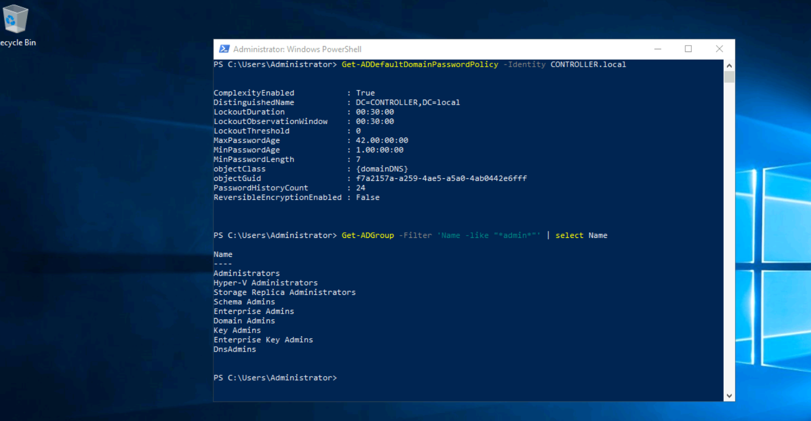

# Powershell Active Directory Enumeration
Enumeration is the most important step when we want to perform a pentest or we want to audit our AD system.
Using powershell instead of external tools will help us to avoid triggering alerts on defense systems (AV,SIEM etc). As we say communicate with a Dog in his language and he won't bite you (okay nobody said that but you've got the idea).

So here is a list of powershell commands for enumeration in Windows Active Directory environment. 

IMPORTANT : most of those commands are integrated to Active Directory module, you need to import it first before using them if you're not in windows server.

AD Module LINK : https://github.com/samratashok/ADModule/blob/master/Microsoft.ActiveDirectory.Management.dll

AD Module README : https://github.com/samratashok/ADModule/blob/master/README.md

Learn More From Microsoft : https://learn.microsoft.com/fr-fr/powershell/scripting/learn/ps101/03-discovering-objects?view=powershell-7.3

- Basic Enumeration
```text
###This line create a new Organizational Unit (OU) in machineName.domaineName
New-ADOrganizationalUnit -Name:"1SIMPLE1" -Path:"DC=test,DC=1simple1" -ProtectedFromAccidentalDeletion:$true -Server:"TestServer.test.1simple1"

###Force Update Active Directory
gpupdate /force

###Get All Users With All Properties
Get-ADUser -Filter *

###Get User Where username==hello.test With Basic Properties
Get-ADUser -Filter "SamAccountName -eq 'hello.test'"

###Get User Where username==hello.test in the server test.1simple1
Get-ADUser -Filter "SamAccountName -eq 'hello.test'" -Server test.1simple1

###Get User with (mail, lastLogin and WhenCreated) Where username==hello.test in the server test.1simple1
Get-ADUser -Filter "SamAccountName -eq 'hello.test'" -Server test.1simple1 -Properties lastLogon, mail, WhenCreated


###Get All Organizational Unit (OU)
Get-ADOrganizationalUnit -Filter *

###Get All Organizational Unit (OU) DistinguishedName as Table Format
Get-ADOrganizationalUnit -Filter * | Format-Table DistinguishedName

###Redirect CN=Users to a specific Organizational  (OU)
###ou=myusers,DC=test,dc=1simple1 is the path for this exemple
redirusr ou=myusers,DC=test,dc=1simple1

###Redirect CN=Computers to a specific Organizational  (OU)
###ou=mycomputers,DC=test,dc=1simple1 is the path for this exemple
redircmp ou=mycomputers,DC=test,dc=1simple1
```

- Enumerate Domain Users
```text
#Get Users in a specific Domain 
Get-ADUser -server YourDomaincontroller -Filter * -Properties *

#Get Users with PasswordNotRequired set to true
Get-ADUser -server YourDomaincontroller -Filter {PasswordNotRequired -eq $true}

#Get user's accounts that do not Require Kerberos Preauthentication 
Get-ADUser -Filter 'useraccountcontrol -band 4194304' -Properties useraccountcontrol | Format-Table name

#Enumerate user accounts with serverPrincipalName attribute set
Get-adobject -filter {serviceprincipalname -like "*"}  | Where-Object {$_.distinguishedname -like "*CN=Users*" -and $_.name -ne "krbtgt"}
```

- Enumerate Domain Computers
```text
#Get Computers in a specific Domain 
Get-ADComputer -server Domaincontroller -Filter * -Properties *

#Get all active computer list in domain
Get-ADComputer -Filter {enabled -eq $true} -properties *

#Get computers with outdated OS (in this exemple we are looking for computers on Windows 7)
Get-ADComputer -Filter 'operatingsystem -like "*Windows 7*" -and enabled -eq "true"' -Properties *
```
- Enumerate Domain Trust:
```text
#Get the list of all trusts within the current domain
Get-ADTrust -Filter *
```
- Enumerate File Shares:
```text
#Retrieves the SMB shares on the computer
Get-SmbShare
```
- Other Objects Enumeration:
```text
#Shows the tickets in memory
klist

#Get the default domain password policy from a specified domain
Get-ADDefaultDomainPasswordPolicy -Identity YourDomain

#Get all groups that contain the word "admin" in the group name
Get-ADGroup -Filter 'Name -like "*admin*"' | select Name    

#Get all members of the "Domain Admins" group
Get-ADGroupMember -Identity "Domain Admins" -Recursive

#Get group membership for a specific user (here: user.test)
Get-ADPrincipalGroupMembership -Identity user.test
```



